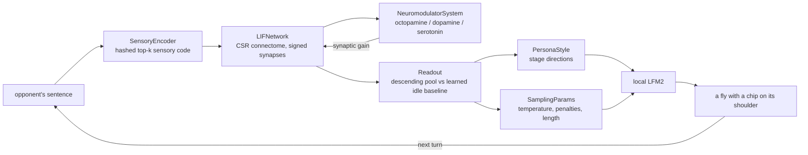

# flykirk

A fruit fly connectome wired to a local Liquid AI small language model, so it can
do campus-debate parody.

The fly does not read your prompt. Text is hashed onto its sensory neurons, the
spiking activity spreads through the wiring diagram, the descending-neuron pool
gets measured, and that measurement writes the system prompt *and* sets the
sampler. Two turns of the same sentence produce different output because the
brain between them changed.

**Parody.** The debating register is modelled on the public campus-debate style of
Charlie Kirk. The register is built from observable rhetorical mechanics — the
rapid-fire pacing, the debate-me dare, the reflexive pivot, the capped claim
stack — not from a script or from his positions. Not affiliated with, endorsed
by, or connected to Charlie Kirk, Turning Point USA, or any other person or
organisation, and no output should be quoted as anyone's statement. The default
motions are absurd on purpose: the comedy comes from applying debate-bro
mechanics to soup and traffic cones.

Select the register with `--register kirk` (aliases: `campus-debate`,
`charlie-kirk`; `flykirk personas` lists them).

---

## Install

```bash
git clone https://github.com/AliRezaei-Code/flykirk && cd flykirk
pip install -e .            # numpy is the only runtime dependency
make test                   # 93 tests, no network, no model
```

## Quickstart, no model, no download

```bash
make demo
```

The `--offline` path uses a scripted speaker instead of a language model, so the
whole brain pipeline runs with nothing but numpy. It is the fastest way to see
what the brain contributes:

```
FLY-1  (round 2)
  descending pool    1.59 Hz   recruitment   0.79 Hz   population    1.48 Hz
  agitation   ##################.... 0.84
  confidence  ####################.. 0.90
  dominance   ##########............ 0.46
  speech      5.53 syllables/s   OA 0.39  DA 0.40  5HT 0.35
  sampler: temp 1.03  top_p 0.95  freq 0.20  pres 0.64  max 234
  Hold on, hold on. The cereal is a settled question and the other side knows
  it. Every argument for the cereal falls apart the second you say it out loud.
```

Watch `descending pool` and `temp` climb across rounds. Nobody programmed that:
octopamine accumulates with activity, serotonin accumulates more slowly, and the
fly gets louder until it gets tired.

## Quickstart with a real local model

Get a Liquid AI LFM2 GGUF being served by anything OpenAI-compatible:

```bash
ollama serve
ollama pull hf.co/LiquidAI/LFM2.5-1.2B-Instruct-GGUF:Q4_K_M   # ~700 MB
```

or, with llama.cpp:

```bash
llama serve -hf LiquidAI/LFM2-700M-GGUF:Q4_K_M                 # http://localhost:8080/v1
```

Then:

```bash
flykirk doctor                                                  # verifies the endpoint
flykirk debate --rounds 3 --show-brain \
    --topic "Resolved: soup is not a meal."
```

Point it anywhere else with `--base-url`, `--model`, `--api-key`, or the
`FLYKIRK_BASE_URL` / `FLYKIRK_MODEL` / `FLYKIRK_API_KEY` environment variables.

## Using the real FlyWire connectome

By default flykirk runs on a **synthetic block-model surrogate** — a graph tagged
`provenance="synthetic-surrogate"` in every artifact it produces, so it can never
be confused with the real thing. It reproduces the fly's superclass composition,
transmitter mix, sparsity and heavy-tailed synapse counts, and it exists purely so
the pipeline runs offline in seconds.

For the real wiring diagram:

```bash
flykirk fetch annotations                    # 31.7 MB, 139,248 neurons
flykirk fetch connectome --source zenodo     # 852 MB, the FlyWire 783 proofread edges
flykirk debate --source zenodo --rounds 3
```

Measured on a 16-core desktop, end to end:

```
connectome      139,248 neurons, 4,660,198 connections, 39,767,448 synapses
csr footprint   57.0 MB
out-degree      mean 33.5  p50 22  max 7244
inhibitory      21.9% of connections (per-synapse transmitter predictions)
built in        44.6 s
```

The feather carries a predicted transmitter for every presynapse, so each edge
takes its sign from its own synapses rather than from the presynaptic neuron's
dominant transmitter — a neuron that is cholinergic on most of its outputs can
still be GABAergic on one of them. A full 139,248-neuron brain costs about 25 s
to build and stimulate, and about 50 s for a two-turn debate, on CPU.

Data comes from the FlyWire Consortium's public releases:

- annotations: [`flyconnectome/flywire_annotations`](https://github.com/flyconnectome/flywire_annotations)
- connectivity: [Zenodo record 10676866](https://zenodo.org/records/10676866)

```bibtex
@article{Dorkenwald2024, title={Neuronal wiring diagram of an adult brain},
  journal={Nature}, year={2024}, doi={10.1038/s41586-024-07558-y}}
@article{Schlegel2024, title={Whole-brain annotation and multi-connectome cell typing of Drosophila},
  journal={Nature}, year={2024}, doi={10.1038/s41586-024-07686-5}}
```

## How it works



### The connectome

`Connectome` is a CSR sparse graph: nodes are neurons keyed by FlyWire `root_id`,
edges are chemical synapses aggregated per (pre, post) pair and weighted by
synapse count — Drosophila synapses are polyadic, so one anatomical connection
routinely carries tens of release sites. Each presynaptic neuron's transmitter is
folded into the sign of its outgoing weights (GABA, glycine and histamine are
inhibitory; dopamine, serotonin and octopamine are modulatory and contribute a
weak sign-preserving drive). Synaptic input is one `np.bincount`, so the package
needs numpy and nothing else.

### The dynamics

Vectorised leaky integrate-and-fire with three properties that took the most
tuning to get right, and are the reason the output is not noise:

- **Drive normalised by in-degree.** The same parameters behave the same on a
  4,000-neuron surrogate and on all 139,255 FlyWire neurons.
- **Heterogeneous excitability.** A per-neuron bias drawn once per network. A
  homogeneous population driven above threshold is not a brain, it is a clock —
  every neuron fires at the same rate and no stimulus can change anything.
- **Ceilinged spike-frequency adaptation.** Unbounded adaptation pushes
  steady-state rate to `increment × rate × tau_adapt`, which silences the
  population; the ceiling keeps it as a modulation rather than the dominant term.

### The readout

`Readout` learns the fly's **idle** firing pattern while nothing is happening, then
reports how a stimulus moved the descending-neuron pool away from it. Absolute
levels are dominated by global arousal, which is the same for every input; the
deviation is what carries content.

| Field | Meaning | Reaches the model as |
|---|---|---|
| `agitation` | mean rectified recruitment of the descending pool | pace, sentence length |
| `dominance` | excitatory vs inhibitory recruitment | attack or pivot |
| `deflection` | entropy of the recruitment pattern | focus or change the subject |
| `confidence` | sustain: mean recruitment over peak | how much it hedges |
| `stamina` | accumulated adaptation | when to wind down |
| `syllables_per_sec` | dominant frequency of the pool's population rate | speaking rate |

That last one is the honest version of the joke: the fly's own neural oscillation
sets how fast it talks.

### The language model

`OpenAICompatClient` is stdlib-only `urllib` against `/chat/completions`, so any
OpenAI-compatible server works. `ScriptedClient` needs no model at all and makes
`--offline` deterministic.

### The register

`persona/kirk.py` holds the register: openers, transitions, rhetorical moves,
address forms, behavioural tics, and the things it never does. The model is told
the tics, and told what to avoid — a register defined only by what it does
drifts back to generic assistant prose within two turns. `max_claims` caps the
claim stack, because the register's defining move is stacking claims and an
uncapped stack is just noise.

## CLI

```
flykirk doctor                         check environment, data and endpoint
flykirk fetch annotations              download the FlyWire 783 annotations
flykirk fetch connectome --source zenodo   build the real connectome
flykirk graph --neurons 4000           describe the graph in use
flykirk brain --text "banana" --json   stimulate one brain, print the readout
flykirk debate --rounds 3 --offline    run a debate
flykirk personas                       list registers
```

Useful `debate` flags: `--topic` (repeatable), `--random-topic`, `--show-brain`,
`--json-out transcript.json`, `--no-judge`, `--judge-model`, `--source`,
`--neurons`, `--seed`.

## What is real here, and what is not

Stated plainly, because it matters:

- **Real:** the FlyWire annotations and connectivity (when you fetch them), the
  graph structure, the spiking simulation, the neuromodulator dynamics, the
  readout, and the coupling from brain state to prompt and sampler.
- **Approximate:** membrane dynamics are single-compartment LIF, not
  Hodgkin–Huxley; synapses are instantaneous with no short-term plasticity;
  there are no gap junctions, no glia, no hormones.
- **Default surrogate:** without `--source zenodo` the graph is a synthetic block
  model. It is not the FlyWire connectome and every artifact says so.
- **Not claimed:** this is not a mind, a brain emulation, or evidence about
  anything. The fly brain's output is not speech and no readout can make it
  speech; that gap is bridged by a language model, which is the joke.

## Tests

```bash
make test
```

93 tests, all stdlib `unittest`, no network and no model. They cover the sparse
graph (edge aggregation, transmitter sign, drive direction, subgraph induction,
persistence), LIF dynamics (threshold, refractoriness, monotone rate, adaptation
ceiling, calibration), the sensory encoder (determinism, sparsity, loudness), the
readout (bounds, monotonicity, idle baseline, aggregate rules), the persona and
sampling mappings, and a full offline debate.

## 3D scene

`flykirk` can render itself. The head of the fly is built from the **real
FlyWire 783 annotations** — every point in it is an actual neuron at its actual
annotated template position, coloured by superclass, with the 1,303 descending
neurons highlighted and 1,200 real proofread connections drawn between them.
The debate stage shows the live brain readout and sampler.

```bash
flykirk fetch annotations                # 31.7 MB, needed for the head
flykirk debate --rounds 3 --offline --json-out .deep-research/scene/transcript.json
python .deep-research/scene/analyse_flywire.py    # samples real edges from the feather
blender --background --python .deep-research/scene/build_scene.py
```

Outputs land in `.deep-research/scene/`: `flykirk_fly.png`, `flykirk_stage.png`,
`flykirk_wide.png`, and `flykirk_scene.blend`.

Two honest caveats, printed on a card in the scene itself:

- The debate readout comes from the **synthetic-surrogate** graph, not the real
  one. The real FlyWire data is only used for the 3D head.
- The FAFB template's z axis is compressed relative to anatomy (x span 203.8 µm,
  y 97.9 µm, z 6.95 µm), so z is exaggerated **10×** for legibility. x and y
  keep their true relative scale.

The scene is a parody set-piece like the rest of the project: the debater is a
generic stylised figure with no likeness to any real person, and the card in
scene repeats the non-affiliation disclaimer at the top of this file.

## What the literature says about this

`.deep-research/` holds an adversarial audit of this repo against the FlyWire
primary sources — 327 unique references, and the headline connectivity numbers
recomputed from the released 852 MB feather. Short version: the numbers are
reproducible but rest on an **undisclosed ≥3-synapses-per-neuropil threshold**
(the full v783 graph has 16,847,997 connections and 54,492,922 synapses), and
several README claims need revision. See `.deep-research/research-report.md`.

## License

MIT. FlyWire data products remain under the FlyWire Consortium's own terms.
